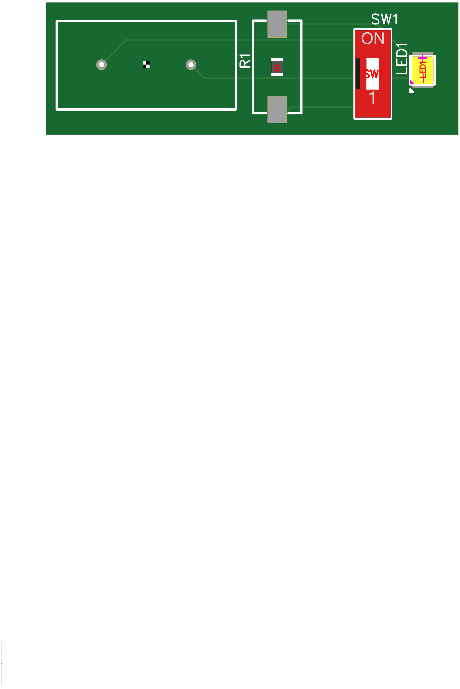

# Orph-Light
This is a flashlight made for a Pacfic Crest Hike. It's my first time making a PCB and 3D printing. The flashlight is a fairly simple circuit

First up, the 3D case, I didn't fully make this, I changed a template and made it better suit the PCB. Trail Themed too! 

Can't have a case for a PCB without a PCB, what's the flashlight like?

We have some prototypes here, here is one with a cardboard case

Here is what it really looks like 

Keep in mind that the finished PCB would be way different.
One issue I found was clicking a button isn't convenient, so we added a switch instead!

